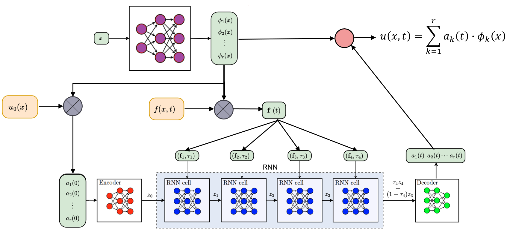

# RHYME-XT: A Neural Operator for Modelling Excitable Spatio-Temporal Rhythms




See paper [Marijn Ruiter, _RHYME-XT: A Neural Operator for Modelling Excitable Spatio-Temporal Rhythms_ (2025)](-) for a description of the architecture.

The `RHYME-XT` package provides the PyTorch module implementing the architecture,
and some auxiliary functions which can be used for training.

This repository also contains scripts to train a model using synthetic data.
To generate the data, the [`semble`](https://github.com/Marijn-dev/RHYME-XT/tree/master/semble) package is required.
First create a data file as follows:

```shell
  python experiments/semble_generate.py --n_trajectories 500 --n_samples 200 data_generation/brian2_LIF.yaml LIF_test_data
```

This will create a data file in `./data/LIF_test_data.pkl`.

The script `experiments/train_wandb.py` provides an example of training the model using PyTorch.
The [`wandb`](https://pypi.org/project/wandb/) package is required to run the script.
Set the environment variable `WANDB_DISABLED=true` if you do not have a Weights & Biases account or do not want to log the results.
Then, run the script as follows:

```shell
  python experiments/train_wandb.py data/LIF_test_data.pkl LIF_test
```

This will create a directory in `./outputs/LIF_test` containing the model parameters and some metadata.
To simulate the trained model, you can use the help script `experiments/interactive_test.py`.
